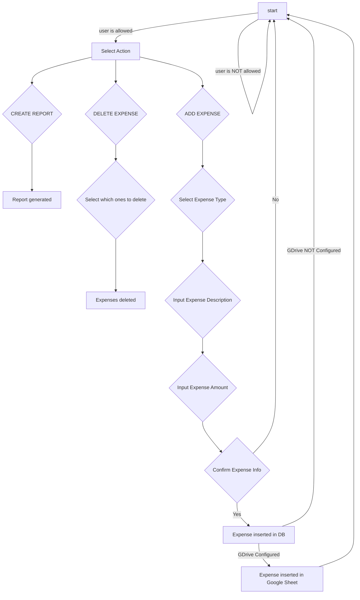

# Household Expenses Bot

## _A Telegram bot to manage household expenses_
_Written in Python_

**Why?** Have you ever tried keeping track of household expenses in a shared spreadsheet? You walk out of the store, arms full of groceries, and while you’re loading everything up you’re supposed to type the expense into a cell…

That’s why. 

## Features

- Share it with any Telegram user you want
- Categorize expenses easily
- Generate expenses reports easily too (They’re not the prettiest reports, but they get the job done)
- Save the expenses in a Google Sheet too (If you want to. Most likely you’ll open it the first time the report is created and then never look at it again. Totally up to you.)

## Tech
- Telegram: As the interface
- Python: For the logic
- SQlite: For the DB

## Run It!
1. [Create a Telegram bot] and export the Token
```sh
export TG_BOT_HOUSEHOLD_EXPENSES_TOKEN="your_telegram_token"
```
2. Set the values in the config file (more info in the [Config Readme])
3. Install Python dependencies (use of [virtualenvs] is highly recommended)
```sh
$ pip install -r requirements.txt
```
4. Run it
```sh
$ python household_expenses_bot.py
```

## Flow
The basic Telegram Commands are:
```
/start   #Start process 
/cancel  #Cancel process
```


 

## Contribute
Yes, please!

Starting with report generation might be a good idea, since I’ve got the artistic sense of a chickpea. If it were up to me, CSS wouldn’t even exist, but I get that the generated report is uglier than the back of a fridge.

If you wouldn’t touch the report generation with someone else’s finger, or you want to suggest changes or fix a bug, same old story: fork it and PR.

[//]: # 
   [Create a Telegram bot]: <https://telegram.me/BotFather>
   [virtualenvs]: <https://virtualenv.pypa.io/en/latest/>
   [Config Readme]: <https://github.com/FedeAlonso/household_expenses_bot/blob/main/conf/README.md>
